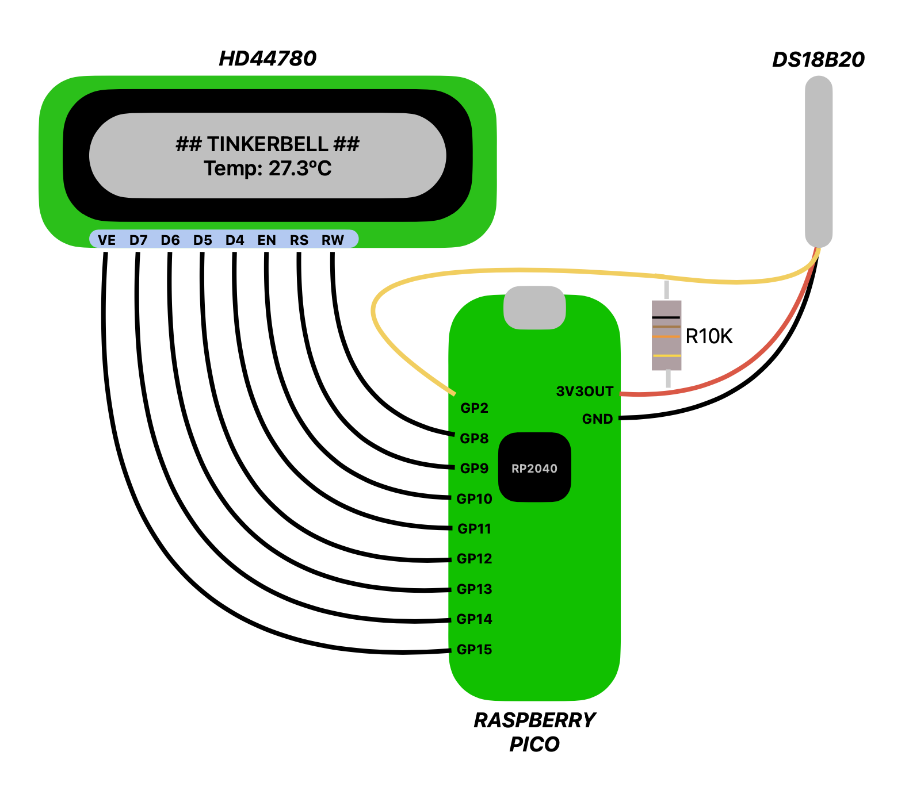

# Leitor Termômetro DS18B20 
Código base em Linguagem Rust com uso do crate Embassy para uso de Raspberry Pico RP2040 com termômetro DS18B20 e informações de temperatura espelhadas em um display HD44780

# Lab

# How to
Para uso deste código siga os passos:
1. git clone https://github.com/andrealvesguimaraes/hd44780_temp_onewire.github
2. cd hd44780_temp_onewire
3. cargo run
> Vale ressaltar que para uso é necessário a instalação do [Probe-RS toolkit](https://probe.rs/) com uso de interface para conexão ao Raspberry Pico via Debug SWD

# Observação
Este código não é um produto final, se trata apenas de laboratório de testes dos componentes:
+ Raspberry Pico RP2040
+ Display HD44780 Hitachi
+ Termômetro DS18B20
+ Crate Embassy_RP
+ Protocolo Onewire
+ Rust Embedded
